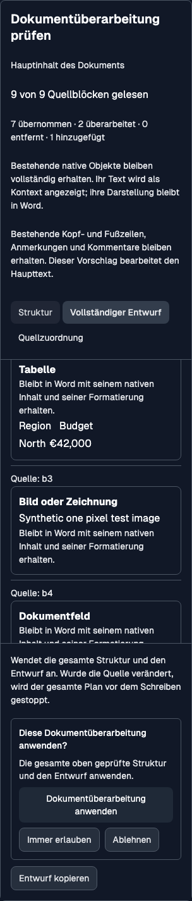

# Mixed-content structural authoring

> **Historical preservation baseline — 18 September 2026.** The source mapping and review improvements below were retained, but the later [rich structured contract](structured-rich-authoring.md) supersedes the preservation-only limits for tables, objects, document parts and sections. See [current implementation status](implementation-status.md) for supported editing operations.

18 September 2026. This corrects the earlier prose-only implementation boundary;
it does not postpone mixed-document preservation to the suggestion phases.

## Behavior at this baseline

A table, image, field, bookmark, comment, note, content control, existing revision
or header/footer no longer makes the entire document unavailable for restructuring.
The reader inventories native content alongside editable paragraphs, headings and
lists. The model receives source text (with table row/cell boundaries), object kinds,
image/control descriptions and preservation constraints;
original XML and binary objects remain on the host.

A plan can rewrite, split, merge, add, delete or reorder editable blocks. It can
move native blocks intact using their source references. Bookmarks, annotation
ranges and complex fields crossing several body elements become one indivisible
block. Section boundaries retain their relative order. The compiler retains the
original package and its linked parts rather than regenerating objects from text.

Preservation is distinct from arbitrary object editing: this change does not add
cell-by-cell table rewriting, image generation, field editing, annotation editing
or deletion of protected native objects. These operations are rejected on the
specific plan. The surrounding document remains available for restructuring.
Locked controls, incomplete anchor/field ranges, missing related content and
unexpanded imports still prevent a reliable body replacement and report the cause.
Track Changes remains under the user's control and must already be off.

A fully editable body can be cleared using an empty output-entry list and explicit
source deletions. The host supplies Word's one empty final paragraph. The private
prompt forbids substituting empty paragraph edits for removal or paragraph edits
for an unavailable structural request. This is a model instruction, not proof of
model compliance; live-model task-quality evaluation remains required.

## Review and execution

The full draft labels retained native objects and shows their readable text as
context. Their real layout remains in Word. The original/proposed structure and
source ledger remain the review surfaces; completion still collapses to a receipt.
The new object preview uses the frontend library's `Card`; restrictions use `Alert`.
All 19 new messages are translated into de/es/fr/pl.

Structural source references no longer double as paragraph ordinals. The paragraph
collection can include table cells, while native inventory includes whole tables
and multi-paragraph ranges. Navigation binds only exact, unambiguous paragraph
matches and verifies their IDs/text again before selecting.

Before writing, the existing whole-package stale-state check still applies.
After writing and during recovery, verification covers native fragment semantics,
relationship destinations and image bytes, headers/footers/comments/notes, existing
style and numbering definitions, fonts, themes and custom XML. Relationship IDs
and media filenames may change if their linked content is identical. A failed
verification remains interrupted, with no success receipt or blind retry.

## Evidence and limits

- Full Office add-in suite: **1,646 tests in 151 files passed**. Strict lint,
  TypeScript and the production build also pass; the existing large-chunk advisory remains.
- Mixed fixtures test intact table/image/field/control/anchor retention, non-adjacent
  rewriting, explicit clear-body deletion, stale/complete reads, concrete limitations,
  section order, and detection of changed linked content.
- **Native Word for Mac 16.113:** a synthetic mixed fixture was opened and saved as
  DOCX; the actual compiler transformed that Word-generated package; Word imported
  and saved the result. The production verifier accepts the result. Source and
  output are retained as [native regression fixtures](../../src/test/fixtures/word-authoring-native/README.md).
- That native check found Word removing redundant top/bottom table-row margin
  exceptions. Verification normalizes only overrides proven equal to inherited
  table/style values. A changed margin remains a failure.
- Actual shared/Word components were checked in Chromium at 400px light and 320px
  dark in German, including full draft, successful mocked application, receipt and
  reopening, without overflow or JavaScript errors.
- Native file import/export is **not** the Office.js `Body.insertOoxml` path. Windows,
  Word web, real add-in apply/revert, concurrent editors and live-model quality remain
  separate acceptance checks. No mock or file round trip certifies these.

Microsoft references: [rich-content packages and relationship preservation](https://learn.microsoft.com/en-us/office/dev/add-ins/word/create-better-add-ins-for-word-with-office-open-xml),
[table margin inheritance](https://learn.microsoft.com/en-us/dotnet/api/documentformat.openxml.wordprocessing.tablecellmargindefault?view=openxml-3.0.1),
[top-margin defaults](https://learn.microsoft.com/en-us/dotnet/api/documentformat.openxml.wordprocessing.topmargin?view=openxml-3.0.1).
