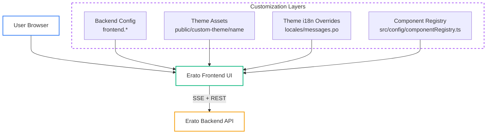

# Frontend architecture

This page explains the structure of the Erato frontend, with a focus on how customization and branding are layered on top of the core UI. It complements the deployment-focused system overview by documenting the frontend-specific architecture.

## High-level structure

The frontend lives in the `frontend/` directory and is built as a single UI bundle that consumes backend APIs and SSE streaming. Customizations are layered through a combination of configuration, themes, and component overrides.



## Core layout and UI composition

The frontend is organized around reusable UI components and page-level layouts. It communicates with the backend through REST endpoints and Server-Sent Events (SSE) for streaming chat responses.

For the backend/streaming lifecycle, see the infrastructure page:

- [Infrastructure Overview](../deployment/infrastructure_overview)

## Customization model

Erato supports three primary customization layers, designed to be used independently or together.

### 1. Configuration-driven UI behavior

Backend configuration values in the `frontend.*` namespace control first-class UI features and behavior. Examples include:

- Enabling/disabling message feedback and comments
- Hiding logout in embedded scenarios
- Disabling file uploads
- Sidebar layout behavior and sidebar logos

These values are injected into the frontend at runtime and can be provided via `frontend.additional_environment` or Vite `VITE_*` variables (with window globals as fallback). The backend is the source of truth for production deployments.

See the [Configuration reference](../configuration) for details.

### Runtime configuration and injection

The frontend reads configuration from two sources:

1. **Vite environment variables** (prefixed with `VITE_`)
2. **Window globals** injected by the backend (for containerized/static deployments)

The backend injects window globals for API root, theme settings, and feature flags such as assistants, prompt optimizer, SharePoint integration, message feedback, and upload limits.

### 2. Theme assets and branding

Branding is handled through theme directories in the frontend bundle:

```
frontend/public/custom-theme/<THEME_NAME>/
├── theme.json
├── logo.svg
├── logo-dark.svg
├── assistant-avatar.svg
└── locales/
    └── <LOCALE_CODE>/messages.po
```

Theme selection is controlled by `frontend.theme` in `erato.toml`, with environment-based overrides available for development and custom deployments. Theme assets must be available at build time.

#### Theme resolution order

`theme.json` is resolved in priority order:

1. `VITE_THEME_CONFIG_PATH` / `THEME_CONFIG_PATH`
2. `VITE_CUSTOMER_NAME` / `THEME_CUSTOMER_NAME` → `/custom-theme/<name>/theme.json`
3. `VITE_THEME_PATH` / `THEME_PATH` → `/custom-theme/<path>/theme.json`
4. Default: `/custom-theme/theme.json`

See the [Theming](../features/theming) documentation for the full structure and configuration options.

### 3. Component registry overrides

For deeper UI customization without modifying core code, the frontend exposes a component registry. Customer forks can replace specific UI components by providing custom implementations and registering them in the registry.

- Registry location: `frontend/src/config/componentRegistry.ts`
- Custom components: `frontend/src/customer/components/`

See [Component Customization](../features/component_customization) for full instructions and examples.

## Internationalization (i18n) and overrides

Default translations are stored in `frontend/src/locales/<LOCALE_CODE>/messages.po`. Theme-specific overrides can be provided in the theme directory and are merged at runtime, with custom strings taking precedence.

See [Internationalization (i18n)](../features/internationalization_i18n) for details on locale structure and override rules.

## Build-time considerations

- Theme assets and theme translation overrides must exist **during the frontend build**.
- The `frontend.theme` value (or `VITE_CUSTOMER_NAME`) must match the theme directory name.
- Component overrides are compiled into the UI bundle, so changes require rebuilding the frontend.

If you rely on runtime-injected environment values, make sure the backend injects them in production to avoid stale or missing configuration.

## Related documentation

- [Theming](../features/theming)
- [Internationalization (i18n)](../features/internationalization_i18n)
- [Component Customization](../features/component_customization)
- [Configuration Reference](../configuration)
