# Infrastructure overview

This page provides an overview of the core architecture and infrastructure components that make up the Erato platform. Understanding these components is essential for successfully deploying and operating Erato in your environment.

Erato's architecture is designed with **extensibility** at its core - particularly through the Model Context Protocol (MCP) servers - enabling you to integrate external data sources, APIs, and tools to meet your organization's specific needs.

The modular design also has significant **operational impact**: the number of running services is kept intentionally small for simpler operation and maintenance, while still allowing you to scale individual components independently and adapt the deployment to your infrastructure requirements.
Some parts (e.g. file processor) also have to option to involve external services as part of their processign steps in order to make them more extensible.

For detailed deployment instructions using Helm, see the [Helm deployment guide](./deployment_helm).

## Architecture Diagram (simplified)

The following diagram illustrates the simplified architecture of an Erato deployment:

**Flow description:**

1. **User** accesses the application through their browser
2. **Authorization Proxy** ([oauth2-proxy](./oauth2_proxy)) handles authentication and validates user sessions via OIDC
3. **Erato App** serves the frontend and provides the backend API
4. **PostgreSQL Database** stores all persistent data (conversations, documents, user settings, etc.)
5. **MCP Servers** provide external integrations and tool capabilities (can be multiple instances for different services)

## Extended Architecture (Example)

The following diagram shows a more concrete example of an Erato deployment with specific MCP servers and external integrations:

**Key components in this example:**

1. **Microsoft Entra ID** provides identity and authentication services:

   - The authorization proxy uses it for OIDC authentication
   - The Erato application reads user and group information from the identity provider for access control and user management

2. **Built-in MCP Servers** (Web Access, Web Search) are deployed as part of the Erato installation and provide web browsing capabilities:

   - **Authentication**: `none/simple` - These servers require no authentication or simple API keys, as they don't access sensitive organizational data

3. **Custom MCP Servers** extend functionality with organization-specific integrations:

   - **Intranet MCP Server** connects to internal company intranet services
   - **Authentication**: `forwarded` - User authentication credentials are forwarded from Erato to the MCP server, allowing it to access the intranet service on behalf of the authenticated user

4. **External MCP Servers** are provided by external SaaS vendors:

   - **JIRA MCP Server** integrates with external SaaS JIRA instance for project management
   - **Authentication**: `oauth2` - The MCP server uses OAuth2 to authenticate with the JIRA service, typically using service account credentials or user-delegated tokens

5. External services (Intranet, JIRA) are accessed through their respective MCP servers, maintaining a clean separation of concerns and proper authentication boundaries

## Message Lifecycle

This section explains how Erato processes chat messages from submission through LLM generation and final persistence.

### High-Level Overview

The message lifecycle consists of five main phases:

```mermaid
sequenceDiagram
    participant 🌐 Frontend
    participant 🖥️ Backend API
    participant 💾 PostgreSQL
    participant 📊 Langfuse
    participant 🤖 LLM Provider
    participant 🔧 MCP Servers

    rect rgba(59, 130, 246, 0.15)
    Note over 🌐 Frontend,💾 PostgreSQL: 1. Submission & Persistence
    end
    🌐 Frontend->>🖥️ Backend API: Submit message (SSE)
    🖥️ Backend API->>💾 PostgreSQL: Save user message
    🖥️ Backend API->>🌐 Frontend: SSE: UserMessageCreated

    rect rgba(16, 185, 129, 0.15)
    Note over 🖥️ Backend API,💾 PostgreSQL: 2. File Processing & Composition
    end
    🖥️ Backend API->>🖥️ Backend API: Process uploaded files
    🖥️ Backend API->>💾 PostgreSQL: Retrieve message history
    🖥️ Backend API->>🖥️ Backend API: Compose generation input

    rect rgba(245, 158, 11, 0.15)
    Note over 🖥️ Backend API,📊 Langfuse: 3. Tracing Setup (if enabled)
    end
    🖥️ Backend API->>📊 Langfuse: Create trace
    🖥️ Backend API->>🔧 MCP Servers: List available tools

    rect rgba(168, 85, 247, 0.15)
    Note over 🖥️ Backend API,🔧 MCP Servers: 4. Turn Lifecycle Loop
    end
    loop Until final message generated
        🖥️ Backend API->>🔧 MCP Servers: Execute pending tool calls
        🖥️ Backend API->>🤖 LLM Provider: Stream chat completion
        🤖 LLM Provider-->>🖥️ Backend API: Response + tool calls
        🖥️ Backend API->>🌐 Frontend: SSE: Text deltas & tool updates
    end

    rect rgba(236, 72, 153, 0.15)
    Note over 🖥️ Backend API,💾 PostgreSQL: 5. Finalization
    end
    🖥️ Backend API->>💾 PostgreSQL: Save assistant message
    🖥️ Backend API->>📊 Langfuse: Update trace output
    🖥️ Backend API->>🌐 Frontend: SSE: MessageComplete
```

### Phase 1: Submission & Persistence

The request arrives via SSE endpoint and the user message is immediately persisted:

```mermaid
sequenceDiagram
    participant 🌐 Frontend
    participant 🖥️ Backend API
    participant 💾 PostgreSQL

    🌐 Frontend->>🖥️ Backend API: Submit message (SSE)<br/>- user_message<br/>- input_files_ids<br/>- previous_message_id (optional)<br/>- chat_id (optional)

    🖥️ Backend API->>💾 PostgreSQL: Get or create chat
    💾 PostgreSQL-->>🖥️ Backend API: Chat record

    🖥️ Backend API->>💾 PostgreSQL: Save user message<br/>- Message content (JSON)<br/>- Chat association<br/>- Previous message link<br/>- Attached file references
    💾 PostgreSQL-->>🖥️ Backend API: message_id

    🖥️ Backend API->>🌐 Frontend: SSE: UserMessageCreated<br/>- message_id<br/>- chat_id
```

**Key operations:**

- Chat is created if it doesn't exist
- User message is immediately saved to ensure it's not lost
- Frontend receives confirmation via SSE event

### Phase 2: File Processing & Message Composition

Files are processed and the complete LLM input is assembled from multiple sources:

```mermaid
sequenceDiagram
    participant 🖥️ Backend API
    participant 💾 PostgreSQL
    participant 📦 File Storage
    participant 📊 Langfuse

    Note over 🖥️ Backend API: File Processing (parallel)
    loop For each input file
        🖥️ Backend API->>📦 File Storage: Fetch file contents
        📦 File Storage-->>🖥️ Backend API: Raw file data
        🖥️ Backend API->>🖥️ Backend API: Extract text (PDF, DOCX, etc.)<br/>Cache result
    end

    Note over 🖥️ Backend API,💾 PostgreSQL: Message History Retrieval
    🖥️ Backend API->>💾 PostgreSQL: Retrieve messages<br/>for this chat
    💾 PostgreSQL-->>🖥️ Backend API: Historical messages (JSON)

    Note over 🖥️ Backend API,📊 Langfuse: System Prompt Retrieval (optional)
    opt Langfuse prompt management enabled
        🖥️ Backend API->>📊 Langfuse: Retrieve system prompt<br/>for chat provider
        📊 Langfuse-->>🖥️ Backend API: System prompt text
    end

    Note over 🖥️ Backend API: Composition
    🖥️ Backend API->>🖥️ Backend API: Build generation input:<br/>1. System prompt (global)<br/>2. Assistant prompt (if configured)<br/>3. Message history (parsed)<br/>4. File contents (as text/images)<br/>5. Current user message
```

**Key operations:**

- Files are processed in parallel with caching for performance
- Message history is retrieved
- Generation input is composed in specific order: system prompt → assistant prompt → history → files → current message

### Phase 3: Turn Lifecycle Loop

The core generation loop handles multi-turn interactions with tool calls:

```mermaid
sequenceDiagram
    participant 🌐 Frontend
    participant 🖥️ Backend API
    participant 📊 Langfuse
    participant 🤖 LLM Provider
    participant 🔧 MCP Servers

    Note over 🖥️ Backend API: Turn Loop (max 15 iterations)
    loop For each turn (turn_number++)

        alt Turn > 1: Process pending tool calls
            loop For each pending tool call
                🖥️ Backend API->>🌐 Frontend: SSE: ToolCallProposed
                🖥️ Backend API->>🔧 MCP Servers: call_tool(server_id, name, args)
                🔧 MCP Servers-->>🖥️ Backend API: Tool result (JSON/text)
                🖥️ Backend API->>🌐 Frontend: SSE: ToolCallUpdate (status: success)
                🖥️ Backend API->>📊 Langfuse: Record tool call span
                🖥️ Backend API->>🖥️ Backend API: Append tool result to messages
            end
        end

        Note over 🖥️ Backend API,🤖 LLM Provider: LLM Generation
        🖥️ Backend API->>📊 Langfuse: Start generation span
        🖥️ Backend API->>🤖 LLM Provider: Request chat completion (streaming)<br/>- messages (with tool results)<br/>- tools (MCP tool definitions)

        loop Stream response
            🤖 LLM Provider-->>🖥️ Backend API: Chunk: text delta
            🖥️ Backend API->>🌐 Frontend: SSE: MessageTextDelta
        end

        🤖 LLM Provider-->>🖥️ Backend API: StreamEnd:<br/>- finish_reason<br/>- tool_calls (if any)<br/>- usage (tokens)

        🖥️ Backend API->>📊 Langfuse: Finish generation span<br/>- input tokens<br/>- output tokens<br/>- model<br/>- latency

        alt finish_reason == "tool_calls"
            🖥️ Backend API->>🖥️ Backend API: Add tool calls to pending queue
            Note over 🖥️ Backend API: Continue to next turn
        else finish_reason == "stop"
            Note over 🖥️ Backend API: Exit loop - generation complete
        end
    end
```

**Key operations:**

- Each turn starts by executing any pending tool calls from the previous turn
- Tool calls are executed via MCP servers with real-time SSE updates
- LLM generation is streamed with text deltas sent to frontend
- If LLM requests more tool calls, loop continues (up to 15 turns)
- Langfuse tracks each turn separately with detailed metrics

### Phase 4: Finalization

The complete assistant message is saved with all metadata:

**Key operations:**

- Assistant message is constructed with all text content and tool uses
- Complete message is saved with generation metadata (model, tokens, turns)
- Langfuse trace is updated with final output
- Frontend receives completion event

### Langfuse Integration

When enabled, Langfuse provides observability throughout the lifecycle:

**Trace Creation:**

- Trace ID created at start of request
- Associated with user_id and session_id (chat_id)

**Generation Spans:**

- One span per turn
- Captures input messages, output, token counts, and latency
- Includes model and provider information

**Tool Call Tracking:**

- Each tool call recorded as metadata
- Tool names aggregated for trace-level statistics

**Final Metrics:**

- Cumulative token usage across all turns
- Total turn count
- Complete request duration
