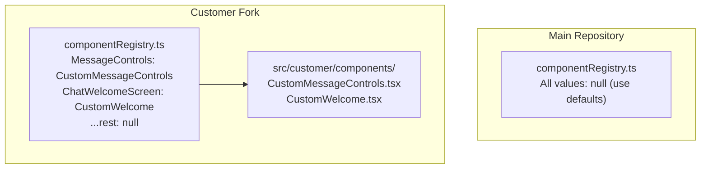

# Component Customization

Erato provides a component registry system that allows customer forks to override specific UI components without modifying core application code. This enables deep customization while maintaining easy upstream synchronization.

## Overview

The component registry pattern provides:

- **Zero dead code** - Custom components only exist in customer forks
- **Minimal merge conflicts** - Only one file (`componentRegistry.ts`) differs between forks
- **Type-safe contracts** - TypeScript ensures custom components match expected props
- **Granular control** - Override individual components without touching any core files

## How It Works



## Available Override Points

| Registry Key                  | Location         | Props Interface                | Description                                                    |
| ----------------------------- | ---------------- | ------------------------------ | -------------------------------------------------------------- |
| `AssistantFileSourceSelector` | Assistant form   | `FileSourceSelectorProps`      | File source selector when adding default files to an assistant |
| `ChatFileSourceSelector`      | Chat input       | `FileSourceSelectorProps`      | File source selector when uploading files to a conversation    |
| `ChatWelcomeScreen`           | Chat empty state | `WelcomeScreenProps`           | Empty state shown when a chat has no messages                  |
| `AssistantWelcomeScreen`      | Assistant chat   | `AssistantWelcomeScreenProps`  | Empty state shown when opening an assistant chat               |
| `MessageControls`             | Every message    | `MessageControlsProps`         | Action buttons below each message (copy, edit, feedback, etc.) |
| `ChatMessageRenderer`         | Every message    | `ChatMessageProps`             | Entire message layout (avatar, bubble, content, controls)      |

Each example is available in `frontend/src/customer/examples/` and can be copied to `frontend/src/customer/components/` as a starting point.

## Quick Start

For any override, the process is the same:

1. Copy the example from `src/customer/examples/` to `src/customer/components/`
2. Modify it to your needs
3. Import and register it in `src/config/componentRegistry.ts`

---

## Message Controls

The `MessageControls` override replaces the action bar shown below every chat message. The default implementation shows copy, edit, raw markdown toggle, and feedback buttons. Custom implementations can add reactions, metadata badges, dropdown menus, or any other per-message UI.

> **Example:** `frontend/src/customer/examples/MessageControls.example.tsx`

### Props Interface

All feature props beyond the core four are optional — your component only needs to use what it cares about:

```tsx
interface MessageControlsProps {
  // Core (always provided)
  messageId: string;
  isUserMessage: boolean;
  onAction: (action: MessageAction) => Promise<boolean>;
  context: MessageControlsContext;

  // Identity
  messageType?: string;
  authorId?: string;
  createdAt?: string | Date;

  // UI behavior
  showOnHover?: boolean;
  className?: string;

  // Raw markdown toggle
  showRawMarkdown?: boolean;
  onToggleRawMarkdown?: () => void;

  // Feedback
  showFeedbackButtons?: boolean;
  showFeedbackComments?: boolean;
  initialFeedback?: MessageFeedback;
  onViewFeedback?: (messageId: string, feedback: MessageFeedback) => void;

  // Message metadata
  hasToolCalls?: boolean;
}
```

The `onAction` callback handles standard actions. Call it with a `MessageAction` and it returns a `Promise<boolean>` indicating success:

```tsx
// Supported action types:
type MessageActionType =
  | "copy" | "delete" | "edit" | "regenerate"
  | "share" | "flag" | "like" | "dislike";
```

### Minimal Example

A stripped-down implementation showing just copy and timestamp:

```tsx
import { useState, useCallback } from "react";
import { MessageTimestamp } from "@/components/ui/Message/MessageTimestamp";
import type { MessageControlsProps } from "@/types/message-controls";

export const MinimalControls = ({
  messageId,
  createdAt,
  onAction,
}: MessageControlsProps) => {
  const [copied, setCopied] = useState(false);

  const handleCopy = useCallback(async () => {
    const ok = await onAction({ type: "copy", messageId });
    if (ok) setCopied(true);
  }, [onAction, messageId]);

  const safeDate = createdAt instanceof Date
    ? createdAt
    : new Date(createdAt ?? Date.now());

  return (
    <div className="flex items-center gap-2">
      <button onClick={() => void handleCopy()}>
        {copied ? "Copied!" : "Copy"}
      </button>
      <MessageTimestamp createdAt={safeDate} />
    </div>
  );
};
```

### Registration

```tsx
// In src/config/componentRegistry.ts
import { CustomMessageControls } from "@/customer/components/MessageControls";

export const componentRegistry: ComponentRegistry = {
  // ...other overrides
  MessageControls: CustomMessageControls,
};
```

### What You Can Do

The bundled example (`MessageControls.example.tsx`) demonstrates several advanced patterns:

- **Emoji reactions** with animated counters (local state demo, extendable to a backend)
- **Raw markdown toggle** wired to the existing `showRawMarkdown` / `onToggleRawMarkdown` props
- **Dropdown menu** using the built-in `DropdownMenu` component for share, branch, delete actions
- **Metadata badges** showing model name, token count, and processing time
- **Conditional UI** — different controls for user messages vs. assistant messages

---

## Chat Message Renderer

The `ChatMessageRenderer` override replaces the entire message layout for every chat message. The default implementation renders a full-width row with avatar, name header, markdown content, tool calls, loading indicator, and controls. Custom implementations can change the visual structure entirely — for example, using chat bubbles with right-aligned user messages.

> **Example:** `frontend/src/customer/examples/ChatMessageBubble.example.tsx`

### Props Interface

The custom renderer receives the same props as the default `ChatMessage` component:

```tsx
interface ChatMessageProps {
  message: UiChatMessage;
  className?: string;
  maxWidth?: number;
  showTimestamp?: boolean;
  showAvatar?: boolean;
  showControlsOnHover?: boolean;

  // Controls component (default or custom, already resolved)
  controls?: MessageControlsComponent;
  controlsContext: MessageControlsContext;
  onMessageAction: (action: MessageAction) => Promise<boolean>;

  // Optional context
  userProfile?: UserProfile;
  onFilePreview?: (file: FileUploadItem) => void;
  onViewFeedback?: (messageId: string, feedback: MessageFeedback) => void;
  allFileDownloadUrls?: Record<string, string>;
}
```

The `controls` prop is the already-resolved controls component (either the default or a custom `MessageControls` override). Your renderer can render it wherever you like — below the bubble, on hover, in a popover, etc.

### Registration

```tsx
// In src/config/componentRegistry.ts
import { ChatMessageBubble } from "@/customer/components/ChatMessageBubble";

export const componentRegistry: ComponentRegistry = {
  // ...other overrides
  ChatMessageRenderer: ChatMessageBubble,
};
```

### Building Blocks

Your custom renderer can import and reuse these components from the core codebase:

| Component | Import | Purpose |
|-----------|--------|---------|
| `MessageContent` | `@/components/ui/Message/MessageContent` | Renders markdown, code blocks, images |
| `LoadingIndicator` | `@/components/ui/Feedback/LoadingIndicator` | Shows streaming/thinking states |
| `ToolCallDisplay` | `@/components/ui/ToolCall` | Renders tool call results |
| `Avatar` | `@/components/ui/Feedback/Avatar` | User/assistant avatar |
| `ImageLightbox` | `@/components/ui/Message/ImageLightbox` | Full-size image modal |
| `Alert` | `@/components/ui/Feedback/Alert` | Error display |

### What the Example Demonstrates

The bundled example (`ChatMessageBubble.example.tsx`) creates a hybrid layout:

- **Right-aligned user messages** as compact chat bubbles with a primary-colored background and asymmetric rounded corners (`rounded-2xl rounded-br-sm`)
- **Full-width assistant messages** with an avatar, neutral background, and plenty of room for code blocks, tables, and long markdown
- **Hover shadow** on user bubbles for subtle depth on interaction
- **Full feature parity** — errors, file attachments, tool calls, streaming, and image lightbox all work correctly

---

## File Source Selector

The `AssistantFileSourceSelector` and `ChatFileSourceSelector` overrides replace the file upload dropdowns in the assistant form and chat input respectively.

> **Example:** `frontend/src/customer/examples/FileSourceSelectorGrid.example.tsx`

### Props Interface

```tsx
interface FileSourceSelectorProps {
  availableProviders: CloudProvider[];
  onSelectDisk: () => void;
  onSelectCloud: (provider: CloudProvider) => void;
  disabled?: boolean;
  isProcessing?: boolean;
  className?: string;
}
```

### Registration

```tsx
import { FileSourceSelectorGrid } from "@/customer/components/FileSourceSelectorGrid";

export const componentRegistry: ComponentRegistry = {
  AssistantFileSourceSelector: FileSourceSelectorGrid, // Grid in assistant form
  ChatFileSourceSelector: null,                        // Keep default in chat
  // ...other overrides
};
```

---

## Welcome Screens

The `ChatWelcomeScreen` and `AssistantWelcomeScreen` overrides replace the empty state shown when a chat has no messages. This is useful for adding quick-start prompts, branding, or onboarding tips.

> **Example:** `frontend/src/customer/examples/WelcomeScreens.example.tsx`

### Registration

```tsx
import {
  CustomWelcome,
  CustomAssistantWelcome,
} from "@/customer/components/WelcomeScreens";

export const componentRegistry: ComponentRegistry = {
  ChatWelcomeScreen: CustomWelcome,
  AssistantWelcomeScreen: CustomAssistantWelcome,
  // ...other overrides
};
```

---

## Full Registry Example

A complete `componentRegistry.ts` with multiple overrides:

```tsx
import { FileSourceSelectorGrid } from "@/customer/components/FileSourceSelectorGrid";
import { ChatMessageBubble } from "@/customer/components/ChatMessageBubble";
import { CustomMessageControls } from "@/customer/components/MessageControls";
import { CustomWelcome } from "@/customer/components/WelcomeScreen";

import type { ComponentRegistry } from "@/config/componentRegistry";

export const componentRegistry: ComponentRegistry = {
  AssistantFileSourceSelector: FileSourceSelectorGrid,
  ChatFileSourceSelector: null,          // Keep default
  ChatWelcomeScreen: CustomWelcome,
  AssistantWelcomeScreen: null,          // Keep default
  MessageControls: CustomMessageControls,
  ChatMessageRenderer: ChatMessageBubble,
};
```

## Merge Strategy

When pulling upstream changes into your fork:

```bash
# Fetch upstream changes
git fetch upstream

# Merge, keeping your registry file
git merge upstream/main

# If conflict in componentRegistry.ts, keep your version
git checkout --ours src/config/componentRegistry.ts
git add src/config/componentRegistry.ts
git commit
```

## Directory Structure

Customer forks should organize custom components in a dedicated folder:

```
/src/customer/
├── components/
│   ├── FileSourceSelectorGrid.tsx    # Custom file selector
│   ├── MessageControls.tsx           # Custom message actions
│   ├── WelcomeScreens.tsx            # Custom empty states
│   └── ...                           # Other custom components
├── hooks/
│   └── ...                           # Custom hooks if needed
└── styles/
    └── ...                           # Custom styles if needed
```

This folder structure ensures:

- Clear separation from core code
- No merge conflicts on customer-specific files
- Easy identification of customizations

## Best Practices

1. **Use theme variables** - Use `theme-*` CSS classes to respect the customer's theme colors
2. **Maintain accessibility** - Include proper ARIA labels and keyboard navigation
3. **Handle all states** - Implement loading, disabled, and error states where applicable
4. **Use i18n** - Wrap user-facing text in `t()` or `<Trans>` for translation
5. **Keep it focused** - Only override what's necessary; rely on defaults for everything else
6. **Destructure only what you need** - All props beyond the core contract are optional; ignore what you don't use
7. **Wrap in `memo`** - Memoize your component to avoid unnecessary re-renders, especially for `MessageControls` which renders per message

## See Also

- [Theming](./theming) - Customize colors, logos, and branding
- [Internationalization (i18n)](./internationalization_i18n) - Language support and custom translations
