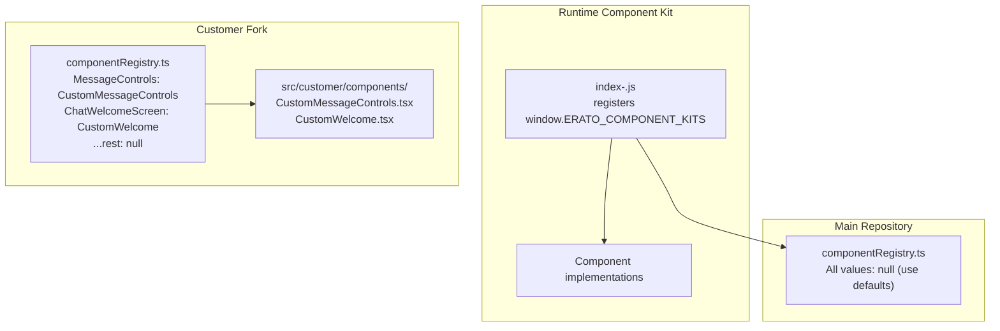

# Component Customization

Erato provides a component registry system that allows deployments and custom builds to override specific UI components without modifying core application code. Runtime component kits are the preferred packaging mechanism for deployment-specific components, while customer forks can still register compiled-in overrides.

## Overview

The component registry pattern provides:

- **Runtime packaging** - Component kits can be deployed outside the main frontend bundle
- **Minimal merge conflicts** - Custom builds can keep overrides isolated in `componentRegistry.ts`
- **Type-safe contracts** - TypeScript ensures custom components match expected props
- **Granular control** - Override individual components without touching any core files

## How It Works


```mermaid
flowchart TB
  subgraph MainRepo[Main Repository]
    MainRegistry["componentRegistry.ts<br/>All values: null (use defaults)"]
  end

  subgraph ComponentKit[Runtime Component Kit]
    KitBundle["index-<hash>.js<br/>registers window.ERATO_COMPONENT_KITS"]
    KitComponents["Component implementations"]
  end

  subgraph CustomerFork[Customer Fork]
    ForkRegistry["componentRegistry.ts<br/>MessageControls: CustomMessageControls<br/>ChatWelcomeScreen: CustomWelcome<br/>...rest: null"]
    CustomComponents["src/customer/components/<br/>CustomMessageControls.tsx<br/>CustomWelcome.tsx"]
  end

  KitBundle --> KitComponents
  KitBundle --> MainRegistry
  ForkRegistry --> CustomComponents
```

## Runtime Component Kits

Component kits are discovered by the backend from `frontend.component_kits.directory`.
Each direct subdirectory is one kit. The backend serves kit files under
`/public/component-kits/<kit-name>/`, injects a root `index-<hash>.js` module
before the main frontend bundle, and injects a root `.css` file when present.

Kits self-register by pushing a `ComponentKitRegistration` into
`window.ERATO_COMPONENT_KITS`. Priorities are per component; lower numbers win.
When priorities are equal, the last loaded component wins.

```ts
import type { ComponentKitRegistration } from "@erato/frontend/library";

window.ERATO_COMPONENT_KITS ??= [];
window.ERATO_COMPONENT_KITS.push({
  name: "my-kit",
  // The ERATO_SHARED_SURFACE_MINOR this kit was built against, as a literal.
  builtAgainstSharedSurfaceMinor: 8,
  components: [
    {
      extensionPoint: "ChatWelcomeScreen",
      component: MyWelcomeScreen,
      priority: 50,
    },
  ],
} satisfies ComponentKitRegistration);
```

### Declaring the surface a kit was built against

An extension point's contract can grow a rule that an override has to carry —
the chat history row, for instance, gained composed badges, a subline and a
gated action menu. An override written before that rule existed cannot be
carrying it, and it fails silently: no error, no warning, just a shipped
feature missing from the customer's UI.

`builtAgainstSharedSurfaceMinor` is how a kit states which contract it knows.
Write it as a literal — importing `ERATO_SHARED_SURFACE_MINOR` and passing that
would only ever agree with itself, because the import map resolves it to the
running host. Leaving it out is read as the oldest possible contract, not as
"no opinion".

The host records a required minor per extension point and compares the two. A
kit that is behind for one point is reported by name, with the point and the
value to declare. What happens next is one switch the deployment owns:

```html
<script>
  window.ERATO_COMPONENT_KIT_VERSION_STANCE = "enforce";
</script>
```

Set it in the same script slot that loads the kit bundles, before the app entry
point runs. The default is `"warn"`: the mismatch is reported and the override
is installed anyway, which is what a fleet of kits that declare nothing needs.
`"enforce"` makes the host render its own component for that one point instead,
leaving the kit's other overrides installed. Flip it once every kit this
deployment loads declares a `builtAgainstSharedSurfaceMinor` at or above each
point's requirement — before that, enforcing reverts customer UI that may be
perfectly current.

### Running the host's contract suite

Declaring a minor says which contract a kit knows about; the suite says whether
its override actually carries it. `@erato/frontend/conformance` exports
host-authored cases that render an override and check the row behaviours a kit
is required to keep — the archived marker, the delegated-run origin line, the
status dot, and every gate on the action menu including the confirmation an
archive has to ask for while a chat is still generating or waiting on a tool
approval.

It is a separate package export rather than part of `@erato/frontend/shared`
because everything on the shared surface is downloaded by every end user, and
this is test infrastructure. Import it only from test files; the kit manifest
check rejects it anywhere else.

```ts
import { chatHistoryListConformanceFailures } from "@erato/frontend/conformance";

it("keeps the row contract", () => {
  expect(
    chatHistoryListConformanceFailures(MyChatHistoryList, {
      render: (element) => render(element),
      openRowMenu: (container) => openMyTrailingMenu(container),
    }),
  ).toEqual([]);
});
```

The suite checks that the required menu ids are present, with the required
disabled and confirmation flags. Order is not read at all: a kit is free to
reorder the host's items, insert its own anywhere, and give any item its own
icon or label. Ids the host gates OUT for a row must stay out: an item rendered
inert is worse than one that is missing.

`component-kit-example/src/components/ExampleChatHistoryList.test.tsx` is a
working harness for a kit that passes the gated array to the host's
`DropdownMenu`: it stubs that one export so `openRowMenu` can return the items
the menu was handed. A kit that draws its own menu reads its own DOM instead.

The main frontend loads a small runtime entrypoint first, then component kit
entrypoints, then the main app entrypoint. Component kits can assume
`window.ERATO_REACT` and `window.ERATO_LINGUI_REACT` are set when their
entrypoint evaluates and should use those host singletons rather than bundling
separate React or Lingui runtime copies. The example package in
`component-kit-example/` registers all current extension points and builds to
the expected `index-<hash>.js` plus `style.css` layout.

Component kits can ship optional translation catalogs at
`locales/<locale>/messages.json` inside their built directory. The frontend
uses the registered kit names to load those catalogs from
`/public/component-kits/<kit-name>/locales/<locale>/messages.json` and merges
them into the same Lingui catalog as the main frontend before rendering custom
components.

## Available Override Points

| Registry Key                    | Location            | Props Interface                      | Description                                                                                                        |
| ------------------------------- | ------------------- | ------------------------------------ | ------------------------------------------------------------------------------------------------------------------ |
| `AssistantFileSourceSelector`   | Assistant form      | `FileSourceSelectorProps`            | File source selector when adding default files to an assistant                                                     |
| `ChatFileSourceSelector`        | Chat input          | `FileSourceSelectorProps`            | File source selector when uploading files to a conversation                                                        |
| `ChatInputAttachmentPreview`    | Chat input          | `ChatInputAttachmentPreviewProps`    | Staged attachments inside the chat composer, above the textarea                                                    |
| `ChatGroupedAttachmentsPreview` | Attachment groups   | `GroupedFileAttachmentsPreviewProps` | Grouped attachment preview cards or chips                                                                          |
| `ChatHistoryList`               | Chat sidebar        | `ChatHistoryListProps`               | Chat history list rows and actions                                                                                 |
| `ChatWelcomeScreen`             | Chat empty state    | `WelcomeScreenProps`                 | Empty state shown when a chat has no messages                                                                      |
| `StarterPrompts`                | Chat welcome screen | `StarterPromptsRendererProps`        | Starter prompt suggestion presentation                                                                             |
| `AssistantWelcomeScreen`        | Assistant chat      | `AssistantWelcomeScreenProps`        | Empty state shown when opening an assistant chat                                                                   |
| `MessageControls`               | Every message       | `MessageControlsProps`               | Action buttons below each message                                                                                  |
| `ChatMessageRenderer`           | Every message       | `ChatMessageProps`                   | Entire message layout                                                                                              |
| `ChatTopLeftAccessory`          | Chat shell          | `ChatTopLeftAccessoryProps`          | Model picker slot in the chat top bar; the host positions it in flow, the kit owns the control and its inner inset |
| `EratoEmailCodeBlock`           | Message code block  | `EratoEmailCodeBlockProps`           | Custom renderer for `erato-email` fenced code blocks                                                               |

Each example is available in `frontend/src/customer/examples/` and can be copied to `frontend/src/customer/components/` as a starting point.

## Quick Start

For any override, the process is the same:

1. Copy the example from `src/customer/examples/` to `src/customer/components/`
2. Modify it to your needs
3. Import and register it in `src/config/componentRegistry.ts`

---

## Message Controls

The `MessageControls` override replaces the action bar shown below every chat message. The default implementation shows copy, edit, raw markdown toggle, and feedback buttons. Custom implementations can add reactions, metadata badges, dropdown menus, or any other per-message UI.

> **Example:** `frontend/src/customer/examples/MessageControls.example.tsx`

### Props Interface

All feature props beyond the core four are optional — your component only needs to use what it cares about:

```tsx
interface MessageControlsProps {
  // Core (always provided)
  messageId: string;
  isUserMessage: boolean;
  onAction: (action: MessageAction) => Promise<boolean>;
  context: MessageControlsContext;

  // Identity
  messageType?: string;
  authorId?: string;
  createdAt?: string | Date;

  // UI behavior
  showOnHover?: boolean;
  className?: string;

  // Raw markdown toggle
  showRawMarkdown?: boolean;
  onToggleRawMarkdown?: () => void;

  // Feedback
  showFeedbackButtons?: boolean;
  showFeedbackComments?: boolean;
  initialFeedback?: MessageFeedback;
  onViewFeedback?: (messageId: string, feedback: MessageFeedback) => void;

  // Message metadata
  hasToolCalls?: boolean;
}
```

The `onAction` callback handles standard actions. Call it with a `MessageAction` and it returns a `Promise<boolean>` indicating success:

```tsx
// Supported action types:
type MessageActionType =
  | "copy"
  | "delete"
  | "edit"
  | "regenerate"
  | "share"
  | "flag"
  | "like"
  | "dislike";
```

### Minimal Example

A stripped-down implementation showing just copy and timestamp:

```tsx
import { useState, useCallback } from "react";
import { MessageTimestamp } from "@/components/ui/Message/MessageTimestamp";
import type { MessageControlsProps } from "@/types/message-controls";

export const MinimalControls = ({
  messageId,
  createdAt,
  onAction,
}: MessageControlsProps) => {
  const [copied, setCopied] = useState(false);

  const handleCopy = useCallback(async () => {
    const ok = await onAction({ type: "copy", messageId });
    if (ok) setCopied(true);
  }, [onAction, messageId]);

  const safeDate =
    createdAt instanceof Date ? createdAt : new Date(createdAt ?? Date.now());

  return (
    <div className="flex items-center gap-2">
      <button onClick={() => void handleCopy()}>
        {copied ? "Copied!" : "Copy"}
      </button>
      <MessageTimestamp createdAt={safeDate} />
    </div>
  );
};
```

### Registration

```tsx
// In src/config/componentRegistry.ts
import { CustomMessageControls } from "@/customer/components/MessageControls";

export const componentRegistry: ComponentRegistry = {
  // ...other overrides
  MessageControls: CustomMessageControls,
};
```

### What You Can Do

The bundled example (`MessageControls.example.tsx`) demonstrates several advanced patterns:

- **Emoji reactions** with animated counters (local state demo, extendable to a backend)
- **Raw markdown toggle** wired to the existing `showRawMarkdown` / `onToggleRawMarkdown` props
- **Dropdown menu** using the built-in `DropdownMenu` component for share, branch, delete actions
- **Metadata badges** showing model name, token count, and processing time
- **Conditional UI** — different controls for user messages vs. assistant messages

---

## Chat Message Renderer

The `ChatMessageRenderer` override replaces the entire message layout for every chat message. The default implementation renders a full-width row with avatar, name header, markdown content, tool calls, loading indicator, and controls. Custom implementations can change the visual structure entirely — for example, using chat bubbles with right-aligned user messages.

> **Example:** `frontend/src/customer/examples/ChatMessageBubble.example.tsx`

### Props Interface

The custom renderer receives the same props as the default `ChatMessage` component:

```tsx
interface ChatMessageProps {
  message: UiChatMessage;
  className?: string;
  maxWidth?: number;
  showTimestamp?: boolean;
  showAvatar?: boolean;
  showControlsOnHover?: boolean;

  // Controls component (default or custom, already resolved)
  controls?: MessageControlsComponent;
  controlsContext: MessageControlsContext;
  onMessageAction: (action: MessageAction) => Promise<boolean>;

  // Optional context
  userProfile?: UserProfile;
  onFilePreview?: (file: FileUploadItem) => void;
  onViewFeedback?: (messageId: string, feedback: MessageFeedback) => void;
  allFileDownloadUrls?: Record<string, string>;
}
```

The `controls` prop is the already-resolved controls component (either the default or a custom `MessageControls` override). Your renderer can render it wherever you like — below the bubble, on hover, in a popover, etc.

### Registration

```tsx
// In src/config/componentRegistry.ts
import { ChatMessageBubble } from "@/customer/components/ChatMessageBubble";

export const componentRegistry: ComponentRegistry = {
  // ...other overrides
  ChatMessageRenderer: ChatMessageBubble,
};
```

### Building Blocks

Your custom renderer can import and reuse these host components. They all arrive as named imports from the single `@erato/frontend/shared` specifier, which the host import map resolves to the app bundle's own module instance:

| Component                                        | Purpose                                |
| ------------------------------------------------ | -------------------------------------- |
| `MessageContent`                                 | Renders markdown, code blocks, images  |
| `LoadingIndicator`                               | Shows streaming/thinking states        |
| `ToolCallInput`, `ToolCallOutput`, `JsonDisplay` | Render tool call arguments and results |
| `Avatar`                                         | User/assistant avatar                  |
| `ImageLightbox`                                  | Full-size image modal                  |
| `Alert`                                          | Error display                          |

```ts
import {
  Alert,
  Avatar,
  ImageLightbox,
  LoadingIndicator,
  MessageContent,
} from "@erato/frontend/shared";
```

A runtime kit cannot resolve the `@/…` alias at all — that alias only exists inside the frontend's own build. An import written against it fails module linking before the kit's entry point runs, which takes the kit's version handshake down with it and leaves every override silently on its default. Deep paths such as `@/components/ui/Message/MessageContent` are not a second way in; `@erato/frontend/shared` is the whole surface. The `@/customer/components/…` paths in the registration snippets above are a different thing and stay as they are: those are for the in-tree fork, where the alias does resolve.

Host class names are a parallel channel with the same property — kits paste them as string literals, so a rename breaks them silently. See [Class Hooks](./theming#class-hooks) for the declared list and for which rules a kit's own utilities can and cannot override.

### What the Example Demonstrates

The bundled example (`ChatMessageBubble.example.tsx`) creates a hybrid layout:

- **Right-aligned user messages** as compact chat bubbles with a primary-colored background and asymmetric rounded corners (`rounded-2xl rounded-br-sm`)
- **Full-width assistant messages** with an avatar, neutral background, and plenty of room for code blocks, tables, and long markdown
- **Hover shadow** on user bubbles for subtle depth on interaction
- **Full feature parity** — errors, file attachments, tool calls, streaming, and image lightbox all work correctly

---

## File Source Selector

The `AssistantFileSourceSelector` and `ChatFileSourceSelector` overrides replace the file upload dropdowns in the assistant form and chat input respectively.

> **Example:** `frontend/src/customer/examples/FileSourceSelectorGrid.example.tsx`

### Props Interface

```tsx
interface FileSourceSelectorProps {
  availableProviders: CloudProvider[];
  onSelectDisk: () => void;
  onSelectCloud: (provider: CloudProvider) => void;
  disabled?: boolean;
  isProcessing?: boolean;
  className?: string;
}
```

### Registration

```tsx
import { FileSourceSelectorGrid } from "@/customer/components/FileSourceSelectorGrid";

export const componentRegistry: ComponentRegistry = {
  AssistantFileSourceSelector: FileSourceSelectorGrid, // Grid in assistant form
  ChatFileSourceSelector: null, // Keep default in chat
  // ...other overrides
};
```

---

## Welcome Screens

The `ChatWelcomeScreen` and `AssistantWelcomeScreen` overrides replace the empty state shown when a chat has no messages. This is useful for adding quick-start prompts, branding, or onboarding tips.

> **Example:** `frontend/src/customer/examples/WelcomeScreens.example.tsx`

### Registration

```tsx
import {
  CustomWelcome,
  CustomAssistantWelcome,
} from "@/customer/components/WelcomeScreens";

export const componentRegistry: ComponentRegistry = {
  ChatWelcomeScreen: CustomWelcome,
  AssistantWelcomeScreen: CustomAssistantWelcome,
  // ...other overrides
};
```

---

## Full Registry Example

A complete `componentRegistry.ts` with multiple overrides:

```tsx
import { FileSourceSelectorGrid } from "@/customer/components/FileSourceSelectorGrid";
import { ChatMessageBubble } from "@/customer/components/ChatMessageBubble";
import { CustomMessageControls } from "@/customer/components/MessageControls";
import { CustomWelcome } from "@/customer/components/WelcomeScreen";

import type { ComponentRegistry } from "@/config/componentRegistry";

export const componentRegistry: ComponentRegistry = {
  AssistantFileSourceSelector: FileSourceSelectorGrid,
  ChatFileSourceSelector: null, // Keep default
  ChatWelcomeScreen: CustomWelcome,
  AssistantWelcomeScreen: null, // Keep default
  MessageControls: CustomMessageControls,
  ChatMessageRenderer: ChatMessageBubble,
};
```

## Merge Strategy

When pulling upstream changes into your fork:

```bash
# Fetch upstream changes
git fetch upstream

# Merge, keeping your registry file
git merge upstream/main

# If conflict in componentRegistry.ts, keep your version
git checkout --ours src/config/componentRegistry.ts
git add src/config/componentRegistry.ts
git commit
```

## Directory Structure

Customer forks should organize custom components in a dedicated folder:

```
/src/customer/
├── components/
│   ├── FileSourceSelectorGrid.tsx    # Custom file selector
│   ├── MessageControls.tsx           # Custom message actions
│   ├── WelcomeScreens.tsx            # Custom empty states
│   └── ...                           # Other custom components
├── hooks/
│   └── ...                           # Custom hooks if needed
└── styles/
    └── ...                           # Custom styles if needed
```

This folder structure ensures:

- Clear separation from core code
- No merge conflicts on customer-specific files
- Easy identification of customizations

## Best Practices

1. **Use theme variables** - Use `theme-*` CSS classes to respect the customer's theme colors
2. **Maintain accessibility** - Include proper ARIA labels and keyboard navigation
3. **Handle all states** - Implement loading, disabled, and error states where applicable
4. **Use i18n** - Wrap user-facing text in `t()` or `<Trans>` for translation
5. **Keep it focused** - Only override what's necessary; rely on defaults for everything else
6. **Destructure only what you need** - All props beyond the core contract are optional; ignore what you don't use
7. **Wrap in `memo`** - Memoize your component to avoid unnecessary re-renders, especially for `MessageControls` which renders per message

## See Also

- [Theming](./theming) - Customize colors, logos, and branding
- [Internationalization (i18n)](./internationalization_i18n) - Language support and custom translations
