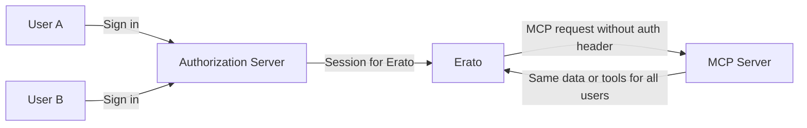
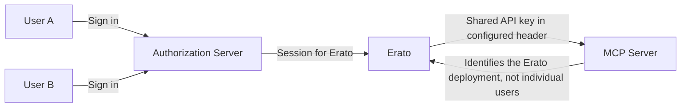
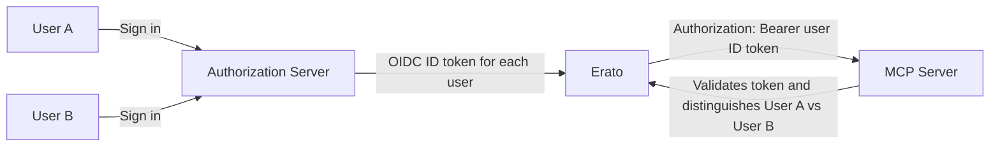
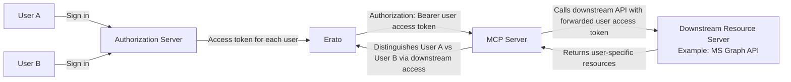
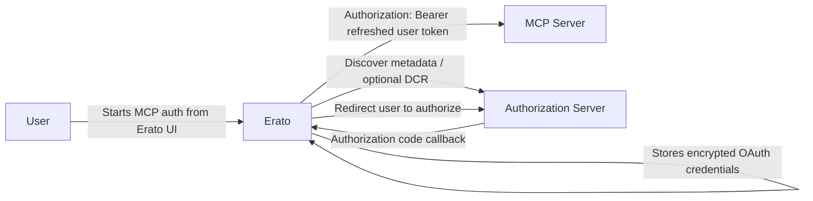

# MCP Servers

Erato supports connecting to [MCP (Model Context Protocol)](https://modelcontextprotocol.io/specification/2025-11-25) servers, allowing you to extend the capabilities of your AI assistant with custom tools and integrations.

## Overview

Model Context Protocol (MCP) is an open standard for connecting AI applications to external data sources and tools.
Through MCP servers, Erato can access file systems, databases, APIs, internal knowledge bses and other external services, making the AI assistant more powerful and versatile.

One benefit for organizations making use of MCP, is that tools/services that provide their functionality via MCP can not only be used from Chat-UIs like Erato,
but can also provide the same tools e.g. your AI-enabled workflow automation solution.

With that MCP can form the basis for a well-rounded AI strategy for your organization.

## MCP servers

When it comes to providing access to a data source or tools via MCP, there are two main approaches:

### Native support

Many SaaS tools in use at organizations are already starting to natively support the MCP standard, by extending their API with dedicated MCP endpoints.

Integrating a service that natively supports MCP can be as simple as getting the API keys for the service and configuring the endpoint with your Erato deployment.

There is a official (non-exhaustive) [list of companies providing official support for their products](https://github.com/modelcontextprotocol/servers#%EF%B8%8F-official-integrations).

### Standalone MCP servers

For services that don't natively support MCP, there is still the option of using a seperate hosted MCP server, that converts between the MCP standard and traditional REST APIs.

Standalone MCP servers are also the common option for MCP servers that provide tools that are unrelated to data storage (e.g. a file conversion tool).

Integrating a standalone MCP server with an Erato deployment usually involves deploying the MCP server and Erato seperately and then configuring Erato to connect to the MCP server.

If you are building your own MCP server, prefer `oauth2` as the authentication mechanism when possible. It is the best fit for user-scoped authorization in Erato and avoids relying on shared credentials or forwarded session tokens.

## Capabilities

Erato's MCP integration provides the following capabilities:

### Tool Discovery and Execution

- Automatic discovery of tools provided by connected MCP servers
- Runtime tool execution with parameter validation
- Error handling and response processing
- Full audit trail of tool calls in chat history

### Multiple Server Support

- Connect to multiple MCP servers simultaneously
- Each server identified by a unique configuration key
- Independent configuration for each server (URLs, authentication, etc.)

## Configuration

MCP servers are configured in your `erato.toml` file under the `[mcp_servers]` section. Each server requires:

1. A unique identifier (used as the configuration key)
2. Transport type specification
3. Server URL endpoint
4. Authentication configuration
5. Optional per-server idle timeout override

**Example:**

```toml
# Optional global default for MCP session idle timeout (seconds)
[mcp_servers_global]
max_session_idle_seconds = 1200

[mcp_servers.file_provider]
transport_type = "sse"
url = "http://127.0.0.1:63490/sse"

[mcp_servers.file_provider.authentication]
mode = "none"

[mcp_servers.api_integration]
transport_type = "sse"
url = "https://api.example.com/mcp/sse"

[mcp_servers.api_integration.authentication]
mode = "fixed"

[mcp_servers.api_integration.authentication.fixed]
api_key = "your-api-token"
header_name = "Authorization"
prefix = "Bearer "

max_session_idle_seconds = 600

[mcp_servers.advanced_service]
transport_type = "streamable_http"
url = "https://api.example.com/mcp"

[mcp_servers.advanced_service.authentication]
mode = "forwarded"

[mcp_servers.advanced_service.authentication.forwarded]
credential = "oidc_id_token"
```

See the [Configuration Reference](../configuration#mcp_servers) for detailed configuration options.

**Session timeout guidance:** If an MCP server allocates a lot of resources per session, set `mcp_servers_global.max_session_idle_seconds` (or that server's `max_session_idle_seconds`) to a low value so idle sessions are cleaned up quickly.

## Access to MCP servers

Authentication controls how Erato connects to an MCP server. Access control decides which users are allowed to see and use that server in the first place.

Erato uses `mcp_server_permissions.rules` for this. These rules are evaluated by the same policy engine used for other configuration-backed resources.

### How rules work

- If no `mcp_server_permissions` are configured, all authenticated users can access all configured MCP servers.
- Each rule targets one or more MCP servers via `mcp_server_ids`.
- Rules are evaluated independently. If any rule grants access to a given server, the user can use it.
- `allow-all` grants access to the listed MCP servers for every authenticated user.
- `allow-for-group-members` grants access only when the user belongs to at least one of the configured `groups`.

Group membership is taken from the `groups` claim in the user's ID token. See [SSO / OIDC](./sso_oidc) for the authentication setup behind that.

### Example

```toml
[mcp_server_permissions.rules.default_tools]
rule_type = "allow-all"
mcp_server_ids = ["filesystem", "company-search"]

[mcp_server_permissions.rules.engineering_tools]
rule_type = "allow-for-group-members"
mcp_server_ids = ["internal-git", "kubernetes"]
groups = ["engineering", "platform-team"]

[mcp_server_permissions.rules.finance_tools]
rule_type = "allow-for-group-members"
mcp_server_ids = ["finance-reports"]
groups = ["finance", "leadership"]
```

With this setup:

- All users can access `filesystem` and `company-search`.
- Only users in `engineering` or `platform-team` can access `internal-git` and `kubernetes`.
- Only users in `finance` or `leadership` can access `finance-reports`.

This affects which MCP servers can be attached to assistants and which servers are available during generation for a given user.

## Deployment Considerations

When deploying Erato with MCP servers:

- Ensure MCP server endpoints are accessible from the Erato backend
- Configure appropriate network policies for security
- Use HTTPS for production deployments
- Consider using multiple configuration files to separate MCP server configurations from main application config

For Kubernetes/Helm deployments, you can use the multi-configuration file support to manage MCP server configurations separately, which can also facilitate splitting up the deployment of Erato and the MCP servers into separate helm charts. See the [Helm Deployment](../deployment/deployment_helm#multiple-configuration-files) documentation for details.

## Transport Types

The MCP standard features the following transport protocols:

### Streamable HTTP

[Section in MCP specification](https://modelcontextprotocol.io/specification/2025-03-26/basic/transports#streamable-http).

The **Streamable HTTP** transport is a modern protocol for efficient, bidirectional streaming of data between Erato and MCP servers over HTTP.
It is designed to support advanced use cases and improved performance compared to traditional Server-Sent Events (SSE).

For Erato, this is currently the recommended transport protocol for connecting with MCP servers.

- **Transport Type:** `"streamable_http"`
- **Protocol:** HTTP/HTTPS with full-duplex streaming (see MCP spec)
- **Use Cases:** High-performance integrations, advanced tool servers, large data transfers
- **Configuration:** Requires a URL endpoint for the MCP server

**Example configuration:**

```toml
[mcp_servers.advanced_service]
transport_type = "streamable_http"
url = "https://api.example.com/mcp"

[mcp_servers.advanced_service.authentication]
mode = "fixed"

[mcp_servers.advanced_service.authentication.fixed]
api_key = "your-api-token"
```

### Server-Sent Events (SSE, aka HTTP+SSE)

[Section in MCP specification](https://modelcontextprotocol.io/specification/2024-11-05/basic/transports#http-with-sse)

The SSE transport uses HTTP with Server-Sent Events for bidirectional communication with MCP servers.

- **Transport Type:** `"sse"`
- **Protocol:** HTTP/HTTPS with Server-Sent Events
- **Use Cases:** Web-based MCP servers, cloud-hosted services
- **Configuration:** Requires a URL endpoint (conventionally ending with `/sse`)

Both SSE and Streamable HTTP transports are fully supported in Erato, allowing you to choose the transport that best fits your deployment needs.

### stdio

[Section in MCP specification](https://modelcontextprotocol.io/specification/2025-03-26/basic/transports#stdio).

The `stdio` transport type is a method for communicating with MCP servers via standard input and output streams, typically used for local process integration.

Erato does **not natively support** the `stdio` transport type.

- **Protocol:** Local process communication via stdin/stdout (requires proxying)
- **Configuration:** Use a proxy tool to expose the local `stdio` MCP server as an SSE endpoint, then configure Erato to use the `sse` transport type and point to the proxy's URL

> [!NOTE]
>
> MCP servers that only implement the `stdio` transport are often not intended for organizational use cases, and may lack support for proper multi-user scenarios.
>
> If you nevertheless want to connect a MCP server that only supports the `stdio` transport, you can proxy it via tools such as [mcp-remote](https://github.com/geelen/mcp-remote) and configure Erato with the resulting `sse`/`http` transport/endpoint
> in Erato.
>
> For most scenarios, use MCP servers that support the `streamable_http` transport type directly, if possible.

## Authentication

Erato currently supports four MCP authentication modes, that offer different trade-offs in terms of ease-of-use and security.

Separate to authentication, access to MCP servers may also be secured on a network level to lock down access only to Erato and/or other known MCP clients.

### Choosing a mode

- `oauth2`: Preferred option when the MCP server supports it. Erato manages the OAuth flow and stores credentials per user.
- `forwarded`: Reuses a credential from the user's current Erato session. Best for tightly controlled internal setups.
- `fixed`: Uses one shared API key for all requests from the Erato deployment.
- `none`: Sends no credentials at all. Only suitable for public or otherwise unauthenticated MCP servers.

### `none`

No credentials are attached to requests for that MCP server.

To forego authentication can be suitable for utility services that do not expose confidential data in the organization and have no user-dependent authorization needs.

Examples:

- Weather service
- News service

```toml
[mcp_servers.public_tools.authentication]
mode = "none"
```



### `fixed`

Attach a configured fixed API key for all requests to that MCP server. By default Erato sends `Authorization: Bearer <api_key>`, but you can configure a different header name and prefix when required by the MCP server.

This can be a suitable easy to set up authentication mechanism for data that should be available to anyone in an organization, e.g. key company information, RAG data from company-wide knowledge base.

As this uses one shared API key for all users, it is not suitable for identity-aware authorization, where different users should have access to different resources on the server.

For a complete example server implementation, see the [`api-key-server` example project](https://github.com/EratoLab/example-mcp-servers/tree/main/api-key-server).

```toml
[mcp_servers.partner_api.authentication]
mode = "fixed"

[mcp_servers.partner_api.authentication.fixed]
api_key = "your-api-key"
```

```toml
[mcp_servers.partner_api.authentication]
mode = "fixed"

[mcp_servers.partner_api.authentication.fixed]
api_key = "your-api-key"
header_name = "X-API-Key"
prefix = "Token "
```



### `forwarded`

Forward credentials from the current user session to the MCP server. The selected token is sent as `Authorization: Bearer <token>`, so the MCP server can validate the token and make user-specific authorization decisions.

> [!WARNING]
>
> Only use `forwarded` authentication when it is strictly necessary, and preferably only for internally maintained MCP servers.
>
> Even then, prefer forwarding the `oidc_id_token` over the `access_token` whenever the server can work with it, to reduce the risk of permission leakage into downstream systems.
>
> Among other issues, the MCP project documents ["Token Passthrough"](https://modelcontextprotocol.io/docs/tutorials/security/security_best_practices#token-passthrough) as an auth anti-pattern. In a similar manner, if using forwarded credentials, the whole authentication of Erato and all MCP servers sharing the forwarded credentials is as weak as it's least secure individual component.

### `forwarded` with `oidc_id_token`

Forward the OIDC ID token that authenticated the user's Erato session.

This is the preferred forwarded mode when the MCP server can work with an ID token, because it forwards user identity without also forwarding a broader downstream access token.

For a complete example server implementation, see the [`oidc-id-token-server` example project](https://github.com/EratoLab/example-mcp-servers/tree/main/oidc-id-token-server).

```toml
[mcp_servers.intranet.authentication]
mode = "forwarded"

[mcp_servers.intranet.authentication.forwarded]
credential = "oidc_id_token"
```



### `forwarded` with `access_token`

Forward the user's access token from the current Erato session.

This can be useful when the MCP server needs to access downstream APIs on behalf of the user and those APIs expect an access token. Because access tokens are often broader than ID tokens, this should only be used when the MCP server actually needs that kind of delegated access.

```toml
[mcp_servers.intranet.authentication]
mode = "forwarded"

[mcp_servers.intranet.authentication.forwarded]
credential = "access_token"
```



### `oauth2`

Use an OAuth 2.0 authorization flow managed by Erato for the MCP server.

This is the preferred authentication mode whenever the MCP server supports it.

This mode is intended for MCP servers that expose OAuth-protected endpoints and expect Erato to obtain, store, and refresh user-specific credentials. Erato persists the registered OAuth client identity and the per-user OAuth credential state in its database, encrypted at rest using `server.encryption_key`.

This is the right choice when:

- The MCP server follows the MCP OAuth authorization flow
- Users need to authorize Erato against the MCP server separately from their Erato sign-in
- The MCP server requires refreshable user credentials rather than a forwarded Erato session token

Erato supports both:

- Statically configured OAuth clients via `client_id` and optional `client_secret`
- Dynamic client registration when no `client_id` is configured and the authorization server supports registration

For a complete example server implementation, see the [`oauth2-keycloak-dcr-server` example project](https://github.com/EratoLab/example-mcp-servers/tree/main/oauth2-keycloak-dcr-server).

```toml
[mcp_servers.jira.authentication]
mode = "oauth2"

[mcp_servers.jira.authentication.oauth2]
client_name = "Erato Jira MCP"
scopes = ["read:jira-work"]
```

```toml
[mcp_servers.salesforce.authentication]
mode = "oauth2"

[mcp_servers.salesforce.authentication.oauth2]
client_id = "erato-salesforce"
client_secret = "super-secret"
scopes = ["api", "refresh_token"]
```



#### Backend flow support

For OAuth-backed MCP servers, the backend now exposes endpoints that let the frontend list server connectivity and drive the authorization flow:

- `GET /api/v1beta/me/mcp_servers`
- `POST /api/v1beta/me/mcp_servers/{server_id}/oauth/start`
- `GET /api/v1beta/me/mcp_servers/{server_id}/oauth/callback`

The list endpoint evaluates each authorized MCP server and returns one of these status values:

- `SUCCESS`
- `FAILURE`
- `NEEDS_AUTHENTICATION`

#### Operational notes

- Configure `server.encryption_key` before using `oauth2`, otherwise Erato cannot persist OAuth secrets and tokens.
- Dynamic client registration is optional. If your provider requires a pre-registered client, set `client_id` and `client_secret` explicitly.
- Erato closes the temporary MCP session created for status checks immediately after evaluating connectivity, so status checks do not keep idle probe sessions around.
